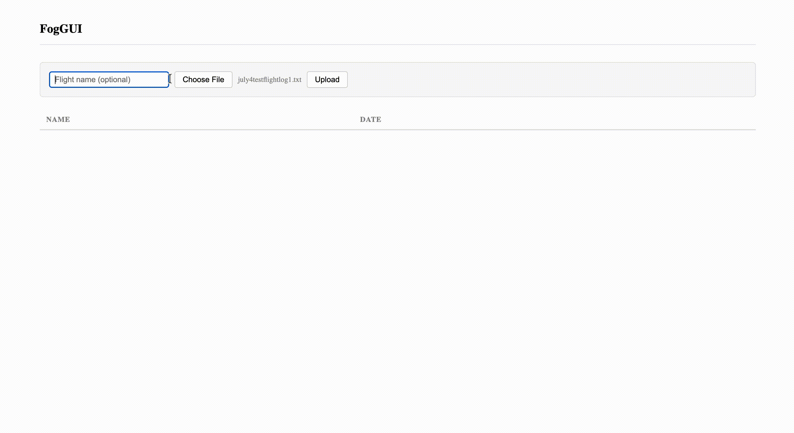

# FogGUI

Atmospheric sensor data platform for drone-based UAV research. Paired with a radio modem, can read live data from an iMet-X4 module mounted on the drone. Provides more flight insight besides raw numbers by displaying charts of temperatures, humidity, and pressure against altitude as data is receieved. It can also be used as a tool to store and analyze previous flights.

**Built with:** 
Python, Flask, PostgreSQL, AWS (Lambda, RDS, S3), Docker

**Analysis site (read-only):** 
[Site Link](https://lvnu5mqk3376y2y5o5263nute40okkdj.lambda-url.us-west-2.on.aws/flights)

**Full demo:**

### Usage types

- **On the field**: 
Reads live data from the serial port, charts the flight locally, and writes a log file for future storage and analysis.
- **For analysis**: 
Interface for researchers to upload log files to the cloud, browse and view recordings of past flights, and delete unwanted logs. 

### Deployment

The cloud app runs on AWS Lambda, with PostgreSQL on RDS to hold structured flight data for querying, and raw log files in S3. 

## Structure

- `app.py` — Flask routes (mode-gated by `FOGGUI_MODE`)
- `foggui/parser.py` — raw serial line to structured reading
- `foggui/sources.py` — serial capture vs. file replay
- `foggui/db.py` — all database access
- `static/` — frontend pages
- `tests/` — parser, database, and API tests
